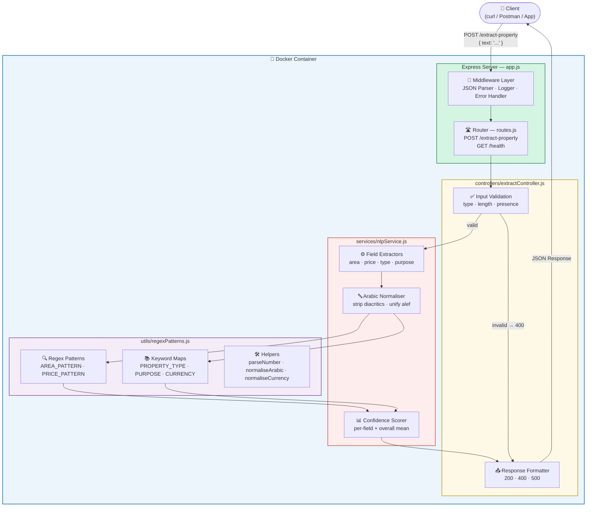
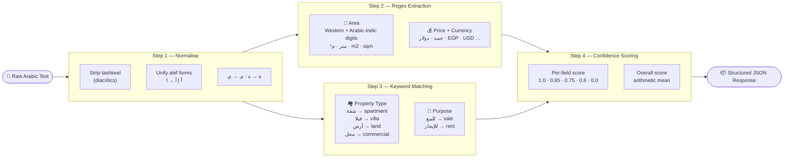
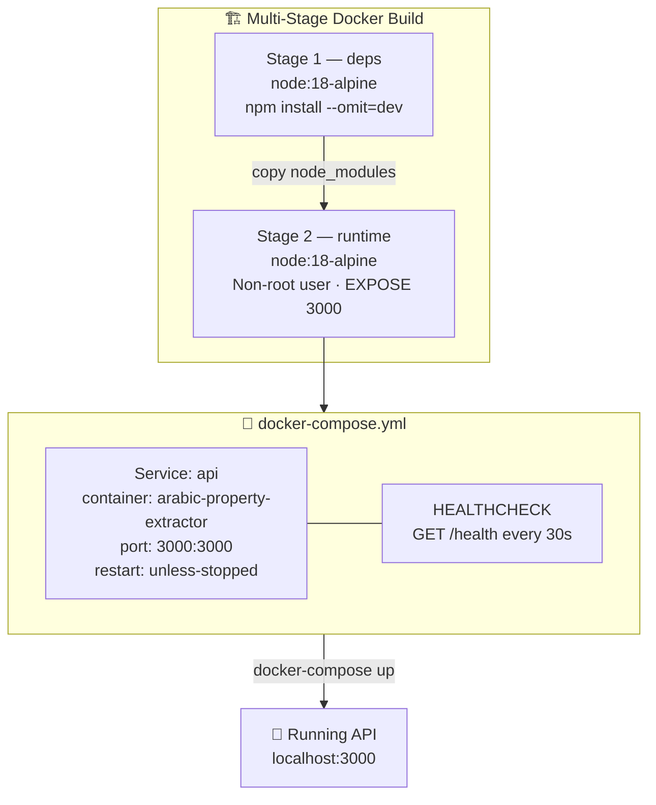

# 🏠 Arabic Property Extractor API

> A Node.js REST API that parses Arabic real-estate listing text and returns structured JSON fields — powered by rule-based NLP.


---

## 📋 Table of Contents

- [Overview](#overview)
- [Architecture](#architecture)
- [Prerequisites](#prerequisites)
- [Technology Stack](#technology-stack)
- [Workflow Breakdown](#workflow-breakdown)
- [Setup Instructions](#setup-instructions)
- [Security Considerations](#security-considerations)
- [Monitoring & Logging](#monitoring--logging)
- [Troubleshooting](#troubleshooting)
- [References](#references)

---

## Overview

The **Arabic Property Extractor API** accepts raw Arabic real-estate listing text via a single HTTP endpoint and returns four structured fields with per-field confidence scores:

| Field | Type | Example |
|---|---|---|
| `area_m2` | number | `120` |
| `price` | number + currency | `500000 EGP` |
| `property_type` | enum | `apartment` / `villa` / `land` / `commercial` |
| `purpose` | enum | `sale` / `rent` |

**Sample**

```json
// Request
{ "text": "شقة للبيع 120 متر بسعر 500000 جنيه مصري" }

// Response
{
  "success": true,
  "data": {
    "area_m2":            { "value": 120,        "confidence": 1.0 },
    "price":              { "value": 500000, "currency": "EGP", "confidence": 1.0 },
    "property_type":      { "value": "apartment", "confidence": 1.0 },
    "purpose":            { "value": "sale",      "confidence": 1.0 },
    "overall_confidence": 1.0
  }
}
```

---

## Architecture

### System Architecture



---

### NLP Pipeline



---

### Docker Infrastructure



---

## Prerequisites

| Tool | Minimum Version | Purpose |
|---|---|---|
| **Docker** | 20.x | Container runtime |
| **Docker Compose** | 2.x | Single-command orchestration |
| **Node.js** *(dev only)* | 18.x | Local development without Docker |
| **npm** *(dev only)* | 9.x | Dependency management |

> **Note:** Docker + Docker Compose are the only requirements to run the service. Node.js is optional and only needed for local development without containers.

Verify your versions:
```bash
docker --version
docker compose version
node --version    # optional
```

---

## Technology Stack

| Layer | Technology | Reason |
|---|---|---|
| **Runtime** | Node.js 18 LTS | Stable, long-term support; native ES2022 |
| **Framework** | Express 4 | Minimal, well-documented REST framework |
| **NLP** | Rule-based (regex + keyword maps) | Deterministic, no model download, zero latency |
| **Containerisation** | Docker + Docker Compose | Reproducible environment, single-command startup |
| **Base image** | `node:18-alpine` | ~50 MB vs ~900 MB — minimal attack surface |
| **Process manager** | Node.js native | Sufficient for a single-service container |

**Why rule-based NLP over ML?**

Arabic property listings are highly structured and formulaic. A regex + keyword approach:

- ✅ Produces **deterministic, explainable** results
- ✅ Requires **zero model training or downloading**
- ✅ Starts **instantly** — no warm-up time
- ✅ Handles both **Western (0-9)** and **Arabic-Indic (٠-٩)** digits
- ✅ Normalises Arabic text before matching (diacritics, alef forms, ta marbuta)

---

## Workflow Breakdown

### Request Lifecycle

```
Client
  │
  │  POST /extract-property  { "text": "شقة للبيع ..." }
  ▼
app.js
  └─▶ express.json()         parse + enforce size limit
  └─▶ request logger         timestamp + method + path
  └─▶ routes.js              match POST /extract-property
        │
        ▼
  extractController.js
  └─▶ validate text          missing? wrong type? empty? too long?
        │ invalid → 400 JSON error
        │ valid ↓
        ▼
  nlpService.js
  └─▶ normaliseArabic()      strip diacritics, unify characters
  └─▶ extractArea()          regex → parse number → filter range
  └─▶ extractPrice()         regex → parse number + currency
  └─▶ extractPropertyType()  keyword scan on normalised text
  └─▶ extractPurpose()       keyword scan on normalised text
  └─▶ score each field       1.0 / 0.85 / 0.75 / 0.6 / 0.0
  └─▶ overall confidence     arithmetic mean of 4 scores
        │
        ▼
  extractController.js
  └─▶ format JSON            200 OK
        │
        ▼
Client  ←  structured JSON response
```

### Confidence Score Rules

| Score | Condition |
|---|---|
| `1.0` | Exact keyword + valid number found |
| `0.85` | Multiple number candidates — most prominent selected |
| `0.75` | Weak or ambiguous keyword match |
| `0.6` | Value found but looks suspicious (e.g. price < 100) |
| `0.0` | Field not detected in text |

`overall_confidence` = arithmetic mean of all four field scores.

### Supported Arabic Keywords

| Field | Arabic | English |
|---|---|---|
| **Apartment** | شقة، وحدة سكنية، ستوديو | apartment, flat, studio |
| **Villa** | فيلا، دوبلكس، تاون هاوس | villa, duplex, townhouse |
| **Land** | أرض، قطعة أرض | land, plot |
| **Commercial** | محل، مكتب، مستودع، عيادة | commercial, office, warehouse |
| **For sale** | للبيع، بالتمليك، تمليك | sale, for sale |
| **For rent** | للإيجار، بالإيجار، إيجار | rent, for rent, rental |

---

## Setup Instructions

### Option A — Docker (Recommended)

```bash
# 1. Clone the repository
git clone https://github.com/your-username/RealEstate-Text-Extractor.git
cd RealEstate-Text-Extractor

# 2. Start the service (single command)
docker-compose up

# Run in background
docker-compose up -d

# Stop the service
docker-compose down
```

The API is live at **http://localhost:3000**.

---

### Option B — Local Development (Node.js)

```bash
# 1. Install dependencies
npm install

# 2a. Start with auto-reload (development)
npm run dev

# 2b. Start in production mode
npm start
```

Override the default port:
```bash
PORT=8080 npm start
```

---

### Verify the service is running

```bash
curl http://localhost:3000/health
```
```json
{ "status": "ok", "service": "arabic-property-extractor", "timestamp": "..." }
```

---

### Sample API Calls

**1 — Apartment for sale (full match)**
```bash
curl -X POST http://localhost:3000/extract-property \
  -H "Content-Type: application/json" \
  -d '{"text": "شقة للبيع 120 متر بسعر 500000 جنيه مصري"}'
```
```json
{
  "success": true,
  "data": {
    "area_m2":            { "value": 120,        "confidence": 1.0 },
    "price":              { "value": 500000, "currency": "EGP", "confidence": 1.0 },
    "property_type":      { "value": "apartment", "confidence": 1.0 },
    "purpose":            { "value": "sale",      "confidence": 1.0 },
    "overall_confidence": 1.0
  }
}
```

**2 — Villa for rent (Arabic-Indic digits)**
```bash
curl -X POST http://localhost:3000/extract-property \
  -H "Content-Type: application/json" \
  -d '{"text": "فيلا للإيجار مساحة ٣٠٠م٢ الإيجار ١٢٠٠ دولار شهريا"}'
```
```json
{
  "success": true,
  "data": {
    "area_m2":            { "value": 300,  "confidence": 1.0 },
    "price":              { "value": 1200, "currency": "USD", "confidence": 1.0 },
    "property_type":      { "value": "villa", "confidence": 1.0 },
    "purpose":            { "value": "rent",  "confidence": 1.0 },
    "overall_confidence": 1.0
  }
}
```

**3 — Partial match (purpose missing from text)**
```bash
curl -X POST http://localhost:3000/extract-property \
  -H "Content-Type: application/json" \
  -d '{"text": "أرض 500 م2 بسعر 200000 جنيه"}'
```
```json
{
  "success": true,
  "data": {
    "area_m2":            { "value": 500,    "confidence": 1.0 },
    "price":              { "value": 200000, "currency": "EGP", "confidence": 1.0 },
    "property_type":      { "value": "land", "confidence": 1.0 },
    "purpose":            { "value": null,   "confidence": 0.0 },
    "overall_confidence": 0.75
  }
}
```

**4 — Validation error**
```bash
curl -X POST http://localhost:3000/extract-property \
  -H "Content-Type: application/json" \
  -d '{}'
```
```json
{ "success": false, "error": "Missing required field: \"text\"" }
```

---

## Security Considerations

### Container Security

- **Non-root user** — The Docker image creates a dedicated `appuser` with no root privileges, limiting the blast radius of any container escape.
- **Minimal base image** — `node:18-alpine` ships with fewer packages, reducing the attack surface compared to full Debian/Ubuntu images.
- **Multi-stage build** — Dev dependencies (`nodemon`) never reach the production image.
- **Body size limit** — Express is configured with `{ limit: '1mb' }` to prevent denial-of-service via oversized payloads.

### Input Validation

All requests are validated before reaching the NLP layer:

| Check | HTTP Status |
|---|---|
| `text` field missing | `400` |
| `text` is not a string | `400` |
| `text` is empty after trimming | `400` |
| `text` exceeds 10,000 characters | `400` |
| Unexpected server error | `500` |

### Recommended Hardening for Production

```yaml
# docker-compose.yml additions for production
services:
  api:
    read_only: true
    security_opt:
      - no-new-privileges:true
    mem_limit: 256m
    cpus: '0.5'
```

---

## Monitoring & Logging

### Built-in Request Logger

Every request is logged to stdout:

```
[2024-01-15T10:30:00.000Z]  POST  /extract-property
[2024-01-15T10:30:00.001Z]  GET   /health
```

### Viewing Logs

```bash
# Follow live logs
docker-compose logs -f

# Last 50 lines
docker-compose logs --tail=50 api
```

### Docker Health Check

Docker automatically polls `GET /health` every 30 seconds:

```bash
docker inspect --format='{{.State.Health.Status}}' arabic-property-extractor
# → healthy / unhealthy / starting
```

### Key Metrics to Monitor

| Metric | What to watch |
|---|---|
| **Response time** | Should stay under 50 ms (no I/O, rule-based) |
| **4xx rate** | High rate = bad client input or integration issue |
| **5xx rate** | Any occurrence should trigger an alert |
| **`overall_confidence`** | Consistently low = text format not covered by current patterns |
| **Container health** | `unhealthy` state = API is down |

---

## Troubleshooting

### Port 3000 already in use

```bash
# Find the process using port 3000
lsof -i :3000

# Or change the host port in docker-compose.yml
ports:
  - "3001:3000"
```

### Container fails to start

```bash
docker-compose up --build
docker ps -a
docker logs arabic-property-extractor
```

### `docker-compose` command not found

On newer Docker versions the command is `docker compose` (no hyphen):

```bash
docker compose up      # Docker Compose v2 (plugin)
docker-compose up      # Docker Compose v1 (standalone)
```

### Fields return `null` with `confidence: 0.0`

The input text does not contain a recognisable pattern for that field. Check:

1. Is the keyword present? (`للبيع`, `شقة`, etc.)
2. Is the number immediately before/after the unit? (`120 متر` ✅ vs `متر 120` ❌)
3. Is the currency keyword adjacent to the price number?

You can extend the keyword maps inside `src/utils/regexPatterns.js`.

### Invalid JSON error from curl

Use single quotes on Linux/macOS:

```bash
# Linux / macOS
-d '{"text": "شقة للبيع 120 متر"}'

# Windows CMD
-d "{\"text\": \"شقة للبيع 120 متر\"}"
```

---


## References

- [Express.js Documentation](https://expressjs.com/)
- [Docker Official Documentation](https://docs.docker.com/)
- [Docker Compose Reference](https://docs.docker.com/compose/)
- [Node.js 18 Release Notes](https://nodejs.org/en/blog/release/v18.0.0)
- [Unicode Arabic Block (U+0600–U+06FF)](https://www.unicode.org/charts/PDF/U0600.pdf)
- [Eastern Arabic Numerals — Wikipedia](https://en.wikipedia.org/wiki/Eastern_Arabic_numerals)
- [Arabic Text Normalisation Techniques](https://arxiv.org/abs/1911.03585)
- [node:18-alpine on Docker Hub](https://hub.docker.com/_/node)

---

